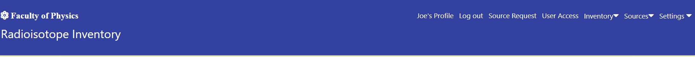
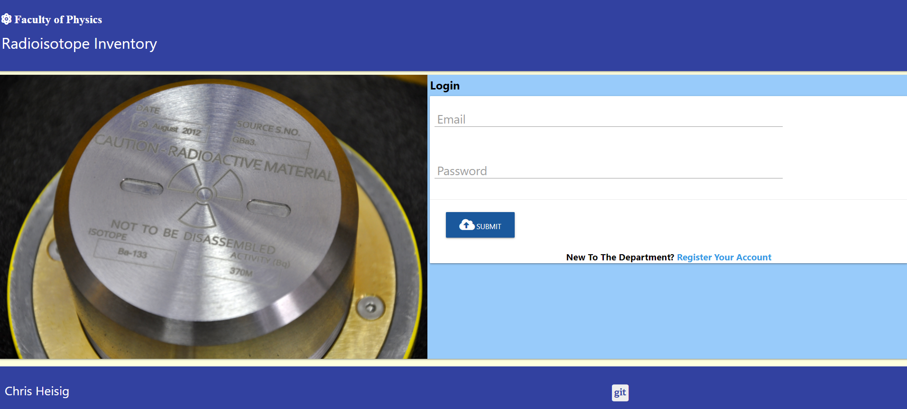
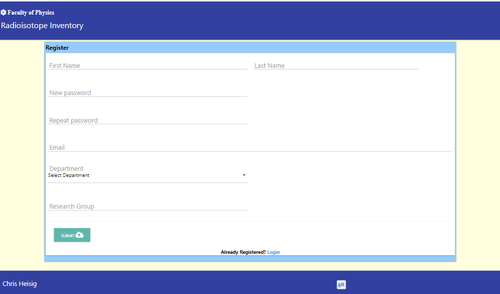

<h1 align="center">Radioisotope Inventory Management</h1>

A university physics faculty is required to maintain stock of radioactive sources for teaching and research purposes.

While individule radioactive sources do not pose a risk to health of students using them, collectively and in the wrong hands they could become a danger to the student community and security risk.

It is therefore crutial that the scientific staff contol student or academic staff usage of these radioactive sources.

**[Access the application here.](https://isotope-3.herokuapp.com/)**

---

## Index 

- <a href="#ux">1. User experience (UX)</a>
  - <a href="#ux-goals">1.1. Project goals</a>
  - <a href="#ux-stories">1.2 User stories</a>
  - <a href="#ux-design">1.3 Design</a>
  - <a href="#info-architecture">1.4 Information architecture</a>
  - <a href="#wireframes">1.5 Wire Frames</a>
   -<a href="#navigation-structure">1.6 Navigation Structure</a>
- <a href="#features">2. Features</a>
  - <a href="#features-existing">2.1 Features Implemented</a>
  - <a href="#features-future">2.2 Features for future implementation</a>
- <a href="#technologies-used">3. Technologies used</a>
- <a href="#testing">4. Testing</a>
- <a href="#deployment">5. Deployment</a>
- <a href="#credits">6. Credits</a>
- <a href="#acknowledgements">7. Acknowledgements</a>
- <a href="#disclaimer">8. Disclaimers</a>

---

<h1>1. User experience (UX)</h1>

### 1.1 Project goals 

- Develop a full-stack application that allows users to access a common dataset.
- Develop a full-stack site that uses HTML, CSS, JavaScript, Python+Flask, MongoDB.

- Creat a website where students and accademic staff can:
    - register and be approved to use radioactive sources
    - see and select a radioactive source from a list of available radioactive sources and submit a request to use one.

- Create a website through which scientific staff can:
    - manage radioactive source allocation to students and accademic staff
    - Create Read Update and Delete radioactive source characteristic details
     
- Creating a website that is:
    - Simple to understand and easy to navigate
    - Presents different levels of access to information for students/accademics and scientific staff.

### 1.2 User stories

**First time user goals:**

1. As a first time user, I want to be able to register with the application so that I am authorised to use the radioactive sources available in the faculty.

**Existing user goals:** 
 
2. As a user, I want to login and out of the web application securely

3. As a user, I want to view my registration profile.

4. As a user, I want to change my password, department and research group.

5. As a user, I want to search for different types of sources that I will need for my research work in the future and view the results.

6. As a user, I want to view all the sources that I have loaned so that I can determine which ones I need to return.

7. As an user, I want the present activity of the source to be calculated and displayed so that I can confirm that it will be suitable for my work.

8. As a user, I want to create a request for a sources of the required type from the inventory of available sources and have my request approved. Note, that it is assumed that accademic staff will know the characteristics of the source that they are searching for. 

9. As a user I want to delete my request prior to its approval if I change my mind regarding the type of source.

**Admin user goals:**

1. As an admin user I want a simple to setup procedure to permit others users to access the application.  

2. As an admin user, I want to approve user each registration request so that I can ensure that the correct Health and Safety briefing has been given.

3. As an admin user, I want to view the registration status of all other users.

4. As an admin user, I want to update the access rights of  other users to that of admin to create deputies

5. As an admin user, I want to suspend a user account to prevent a user from loaning more sources.

6. As an admin user, I want to permanently delete as user acccount, but only if the user has returned all loaned sources

7. As an admin user, I want to view the technical characteristices of all sources so that users can be advised on their selection.

8. As an admin user, I want to view the location of all sources on inventory to satisfy a security audit.

9. As an admin user, I want to create a new entry source entry with the same or different technical charateristc but with a unique serial number.

10. As an admin user, I want to update the technical characteristics of an existing source if there is an error either by selecting from the full inventory or by searching on the serial number.

11. As an admin user, I want to delete a source from the inventory either by selecting from the full inventory or by searching on the serial number, but only if that source has been returned to the inventory.

12. As an admin user, I want to view all the isotope types available

13. As an admin user I want to add isotope types and its respective half life to the list.

14. As an admin user I want to update information assocaited with an isotope.

15. As an admin user I want to delete isotope types, but only if all sources of that isotope type are not on loan.

16. As an admin user, I want to view the full history of source loans so that I can spot any patterns.

17. As an admin user, I want to view how many times a source has been loaned by isotope type so that I can dispose of sources that are not being loaned.

18. As an admin user, I want to view how user logins there have been on a given date so that I can assses how the service is being used.  

**Goals that would appeal to Scientists:**

1. As a scientist, I want to see information presented in a tabular form where possible so that I can spot patterns in the data.

**Goals that would appeal to the general user:** 

1. As a user or admin user, I may want to view information on small screen width devices which do not lend themselves to displaying data in tabular form.

2. As a user or admin user, I want to confirm any delete action that results in the permanet removal of information from the data base.

### 1.3 Design 

- #### Colour scheme 

    The three colours that are used for the radioactive inventory website chosen not to detract from the important information that is presented.

    - **Light yellow** is used for the background to provide contrast for the blue **[Marterialize](https://materializecss.com/cards.html)** cards 

    - **Mid Blue** is used for the header and footer. 

    - **Light Blue** is used for the card panels and these are further inset with **white** cards panels to provide a heading for the page of section and to focus in on the form or table dispayed. 

- #### Fonts

    Sans serif and cursive are the fallbacks in case the main font isn’t being imported to the site correctly. 

- #### Icons

    In the project, icons are used that are provided by [Font Awesome](https://fontawesome.com/). The Icons that are used have functional purposes such as the hamburger menu and social media icons. 

- #### Images

    The images used are provided by [Shutterstock](https://www.shutterstock.com/).

- #### Tables

    As this website will predominently be utilised by individual from the scientific community, considerable use is made of tables. Scientists like to see information in tables so that they can see patterns of date.  **[Cloud Tables](https://cloudtables.com/)** provides an excelent free to use JQuery plugin for this purpose.
s
- #### Collapsibles

    Unfortunately tables do not render well on smaller screen devices and so use is made of the **[Collapsible](https://materializecss.com/collapsible.html)** provided by **Materialize**

### 1.4 Information architecture

The collections **source** and **user** provide the two main data repositories with collections **department**, **location**, **laboratories**, **encapsuationtype** and **security group** providing a repository for constant data.

The collection **source history** and **login history** provide a an activity log allowing admin users to determine which users have loaned sources and how frequently the site is being visited.

The collection **isotope** is considered to be semi permanent data. Over time changing usage patterns may result in some sources of specific isotope type being removed from circuation.

### 1.5 Wire Frames

Wireframes are provide [here](readmeimg/WireFrame/datastructure.png) and are best examined inconjunction with the site navigation structure shown in section 1.6

### 1.6 User Navigation Structure

The navigation structure shown above is reflected in the side bar visible on small and medium screen width devices. 

## 2.0 Features

### 2.1 Features implemented

#### General

- Where information is presented in a tabular for for large screen devices, it is then also presented as collapsible for small screen devices.

#### Users:
- Users must first register to use the service and users accounts must be approved by an admin user.

- A user may search the database for a source type and may request its loan. Only sources that are available will be presented. Although the search facility is provided with a tooltip, it is assumed that accademic staff will know the characteristics of the source that they requre.

- The user may delete the loan request if this has not been approved

- A user may change their password, select another department or enter an new research group.

- A user may view a list of the sources he/she has on loan

#### Admin:

- An admin user must first register as a user.

- An admin user must be promotes to admin status by another admin user.

- An admin user may **suspend** a users account and subsequently reistate it 

- An admin user may delete a user account, but only is the user has returned all sources loaned by him/her.

- An admin user may approve a source load or identify it as returned 

- An admin user may view a full history of source loaned to users as well as key statistics on the number of sources of a particular isotope available, user logins per day and source loaned by serial number.

- An admin user may view the full table of sources available in the inventory and from the table update or delete a source. Note that a source may not be deleted if it is on loan.

- An admin user may create, update or delete a source from the inventory. A source may not be deleted from inventory unless it is identified as returned.

- An admin user may view the list of isotopes types available.

- An admin user may add and update delete an isotope type. Deletion is only possible where sources of that isotope type have been returned to the inventory. 

- Quick User Guide
    
    After sucessfully logging in the admin user lands on his profile page and be exposed to the following navigation options:

    

    - The **Profile Page** permits the admin user to change his/her account details and view the sources he/she has on loan or has requested.It is assumed that admin users may also be academics. 

    - Selecting **Logout** logs the admin user out

    - Selecting **Source Request** permits the admin user to search for an available source. 

    - Selecting **User Access** permits the admin user **approve** a user account to **suspend** another user account and **delete** a user account.

    - Selecting **Inventory** and then **Inventory List** allows the admin user to **view** all sources on inventory, **update** sources and **delete** sources that are not out on loan.

    - Selecting **Inventory** and then **Usage Report** allows the admin user to see how the service is being used.

    - Selecting  **Inventory** and then **Approve Request** allows the admin user to **approve** a request for a source and also its **return**

    - Selecting **Sources** allows the admin user to **add** a new source to the inventory, **update** an existing source and **delete** a source.

    -Selecting **Settings** and then **Isotopes** allows the admin user to view all isotopes, **add** an isotope, **update** an isotope and **delete** an isotope.  

    After sucessfully logging in the admin user lands on his profile page and be exposed to the following navigation options:

    

    - The **Profile Page** permits the a user to change his/her account details and view the sources he/she has on loan or has requested.

    - Selecting **Logout** logs the user out

    - Selecting **Source Request** permits the user to search for an available source. 

- Security

    - Password - at least 8 characters of any type except spaces

    - email - must be in the form xxxxxxx@xxxxx.xxx

    - Research group - at least 3 alphanumeric characters no spaces, hyphons and underscores permitted

    - Source serial number - at least 3 alphanumeric characters no spaces, hyphons and underscores permitted

    - Original activity - at least 2 numeric chacaters plus decimal point (?.?) only no white spaces   

    - half life - at least 2 numeric chacaters plus decimal point (?.?) only no white spaces

    - Isotopes - at least 1 uppercase alpha followed bt 1 lowercase alpha followed by 1 numeric digit - no decimal points or white spaces

    - Users are prevented from accessing html pages intended for admin users

    - A user can only be logged in once.

### 2.1 Features for future implementation

- The current implementation is restricted to the creation, read, update and deletion of isotope types only. A future revision could be expanded to include more setting such as laboratory location and source encapsulation type.

- The current implementation does not include a calcuation for source dose. Future implementation could reference dose tables and provide this calculation.

- A future implementation could include the sending of emails to inform users that their accounts or requests sources have been approved 

<h1>3. Technologies used</h1>

- **Languages used**

    - [Python](https://www.python.org/)

        - Python provides backend functionality. The math module is used for asorted mathematical operations

    - [HTML5](https://en.wikipedia.org/wiki/HTML5)

        - HTML5 provides project structure and content for a browser to render.

    - [CSS3](https://en.wikipedia.org/wiki/Cascading_Style_Sheets)
    
        - CSS3 provides styling of the HTML5 elements.

    - [jQuery](https://jquery.com/)

        - jQuery used as the JavaScript functionality.

- **Frameworks, libraries & Plugins**

    - [Gitpod](https://www.gitpod.io/) 

        - The GitPod provides the development environment.

    - [Git](https://git-scm.com/)

        - The Git was used for version control to commit to Git and push to GitHub.

    - [GitHub](https://github.com/)

        - The GitHub is used as the project repository.

    - [Balsamiq](https://balsamiq.com/)

        - Balamiq is used to create wireframes.

    - [Materialize](https://materializecss.com/)

        - Materialize is used extensively for framework design.

    - [MongoDB](https://www.mongodb.com/1)
    
        -   MongoDB is the fully managed cloud database service used for the project.

    - [Heroku](https://dashboard.heroku.com/)

        - Heroki is the cloud platform used to deploy the service.

    - [Flask](https://flask.palletsprojects.com/en/1.1.x/)

        - Flask is the web framework used to provide libraries, tools and technologies for the app.

    - [Jinja](https://jinja.palletsprojects.com/en/2.11.x/)

        - Jinja is used for templating Python

    - [Werkzeug](https://werkzeug.palletsprojects.com/en/1.0.x/)

        - Werkzeug is used for password hashing.

    - [Cloud Tables](https://cloudtables.com/)

        - Used to generate the tables that are rendered

    - [Matplotlib](https://matplotlib.org/)

        - Python libraries used to generate histograms

- **Testing tools used** 

    - [Chrome DevTools](https://developers.google.com/web/tools/chrome-devtools/open) 
        
        - is used to detect problems and test responsiveness.

    - [W3C Markup Validation Service](https://validator.w3.org/)

        - The W3C Markup Validation Service is used to check whether there were any errors in the HTML5 code.

    - [W3C CSS validator](https://jigsaw.w3.org/css-validator/)

        - The W3C CSS validator is used to check whether there were any errors in the CSS3 code.

    - [JShint](https://jshint.com/)

        - JShint is a JavaScript validator that is used to check whether there were any errors in the JavaScript code. 

    - [PEP8](http://pep8online.com/)

        - The PEP8 validator is used to check whether there were any errors in the Python code.

   

<h1>4. Test Approach</h1>

Functional testing will be based on <a href="#ux-stories"> 1.2 User stories</a>. The associated test methods, expected outcomes, tested outcomes and results are documented in document [TEST.md](TEST.md)

Non functional testing will be based on the non functional requirements set out in section 5.0

<h1>5. Deployment</h1>

## Using the application

The application may be accessed **[Here](https://isotope-3.herokuapp.com/)**. Three user accounts have been set up to aid the first time user:

| User Name| User password|Type|
|---|---|---|
|**joe.black@anyuniversity.com**|**new2new2**|**admin**|
|**niels.bohr@anyuniversity.com**|**new2new2**|**user**|
|**fred.hoyle@anyuniversity.com**|**new2new2**|**user**|

## Requirements

To deploy or clone this project an account is required for the following services  

- Github

- MongoDB 

- Heroku

## Clone this project to your GitHub repository 

The following steps are required to clone this project to your GitHub repository: 

- Log in to your GitHub account 

- Create a new repository.

- Navigate to the new repository

- At the bottom of the page select **Import code**

- Enter the URL **https://github.com/ChrisH2727/Milestone-3.git**

- Select the button **Begin Import**

- Navigate to your new git repository and check that the files are present.

## Getting started in your local IDE

- Within your local IDE create a new workspace

- At the terminal window enter the command **git init** (may not be required)

- At the terminal window enter the command **git clone** and the URL for the GitHub repository to which cloned the Milestone-3 project above  

- At the terminal window enter the command  **pip3 install -r requirements.txt**.

- At the terminal window enter the command **pip3 install matpplotlib**

- At the terminal window enter the command **pip3 install flask**

- At the terminal window enter the command **pip3 install flask_pymong**

- At the terminal window enter the command **pip3 install dnspython**

- Create the file **env.py** and add the following environmental variables:
    
        import os
    
        os.environ.setdefault("IP", IP address in the form "0.0.0.0")

        os.environ.setdefault("PORT", PORT address in the form "5000")
    
        os.environ.setdefault("SECRET_KEY", sequence of alfanumeric characters chosen by the developer "?????????")
    
        os.environ.setdefault("MONGO_URI", ""mongodb+srv://*username*:*password*>@cluster0.hfxth.mongodb.net/*database-name*retryWrites=true&w=majority")Added by developer")
    
        os.environ.setdefault("MONGO_DBNAME", "*database-name*")

  
  *database-name* should be the same as the database name created in section **Creating a MongoDB database** 

- Create a .gitignore file in the root directory of the project and  the **env.py** file in the .gitignore.  Add anyother file names that you do not wish to be uploaded to GitHub.

### Creating a MongoDB database

- Login to your MongoDB account.

- select **Create a Database**

- Enter the name of your *database* and the name of the first collection **sources**

- Navigate to the database and observe that the first collection **sources** is present

- Add the additional collections:

  - **departments**

  - **encapsulations**

  - **isotope_category**

  - **laboratories**

  - **locations**

  - **login_history**

  - **security_group**

  - **source_history**

  - **users**

- For the collection **sources** add the empty string values as per the data architecture description 

- For the collection **users** add the empty string values as per the data architecture description

- For the collection **departments** enter the string values:

    - Physics

    - Chemistry

    - Biology

- For the collection **encapsulations** enter the string values:

    - Disk

    - Capsule

- For the collection **laboratories** enter the string values:

    - lab1

    - lab2

    - lab3

 - For the collection **locations** enter the string values:
    - Top-shelf

    - Middle-shelf
 
    - Bottom-shelf
 
 - For the collection **security_group** enter the string values:
    
     - 4a
 
     - 5d
 
     - 5c

## Running the application for the first time

-  Open the IDE terminal window and enter the following to run the application: 

    - **python3 app.py**

-  Once the app has started:

    

-   Click on the *Register an Account* text

    

-   The first account is always set up as an admin account so that further accounts may be approved.

#### Heroku Deployment  

-   In the IDE terminal window enter the following:

    - **pip3 freeze -- local > requirements.txt** This is required by Heroku to determine the frameworks, libraries, tools and languages needed to run the application.

    - **python app.py > Procfile** This is required by Heroku to determine how to initiate execution of the application

- Log into your Heroku account: 

    - Click on the **new** button
    
    - Select **Create new app**

    - Enter a name for the app (this must be unique)

    - Enter your geographic region

    - Click **Create App**  

3. Deployment method 'Github'

    - Click on the **Connect to GitHub** section in the deploy tab in Heroku. 

        - Search your repository to connect with it.

        - When your repository appears click on **connect** to connect your repository with the Heroku. 

    - Click on the **settings** button 
    
    - Check that the app name displayed is the chosen name for your app
    
    - Click on **Reveal Config Vars**.

    - Enter the variables from the env.py file created in the previous section:
        
        - **IP**, 
        
        - **PORT**

        - **SECRET_KEY**, 
        
        - **MONGO_URI** (with the correct Mongodb username, password and database ) 
        
        - **MONGO_DBNAME**

    - Navigate to the **deploy** tab in Heroku (make sure that this is for your app) 
    
     - Find the section **Deployments method**

     - Select **GitHub**

     - Find the section **Connect to GitHub**

     - Search fo the GitHub **repo name** and select

     - Find the section **Automatic deployments**. 
     
     - Click on **Enable Automatic Deploys From Master**

    - At the top of the page click on **Open App** to launch. Make a note of the URL for future reference.

<h1>6. Credits </h1>

**Sources and Radioactive isotopes**

- Basic list of common radioactive isotopes form [Wikipedia](https://en.wikipedia.org/wiki/Radionuclide)

**Media**

- Login page image [Shutterstock](https://www.shutterstock.com/).

**Code**

- [Materialize](https://materializecss.com) for html code examples for: 
    
    - Collapsible
    
    - Navbar
    
    - Side navbar
    
    - Footer
    
    - Date picker

    - Text input

    - Radio button

- [Cloudtables](https://datatables.net/examples/) html and jQuery examples for the construction of tables that paginate

- Regex pattern for [email verification](https://ihateregex.io) 
Author's Github:https://github.com/geongeorge/i-hate-regex

- Handling 404 and 500 errors https://flask.palletsprojects.com/en/1.1.x/patterns/errorpages/

- matplotlib  https://matplotlib.org/stable/gallery/index.html examples on drawing charts in Python.

<h1>7. Acknowledgements </h1>

- To my mentor **Precious Ljege** for help in understanding security requirements

- To all the staff Code Institute providing **Tutor Assistance** 

<h1>8. Disclaimer </h1>

While the requirements for this project are based on an actual requirement, for security reasons, the information regarding radioactive sources is fictitious