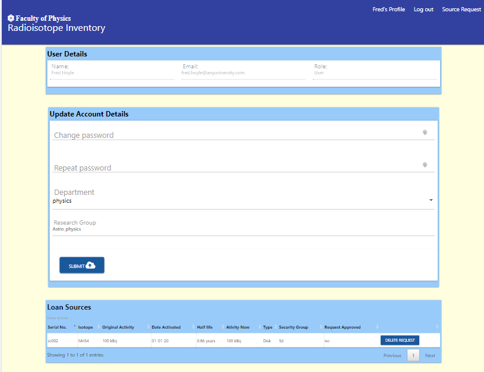

<h1 align="center">Radioisotope Inventory Management</h1>
<h2 align="center"> Milestone 3 Project</h2>

## Index

- <a href="#nonfunctional-test">1. Non-functional test</a>
- <a href="#usecase-test">2. Use case (functional) test</a>
- <a href="#defects">3. Defects</a>

---
<h1>1. Non functional test</h1>

- **javascript static code analaysis**

    

    No errors or wanings reported.

- **CSS validation report**

    

    No errors or wanings reported.

- **PEP8 Validation Report**

TBD

- **HTML Validation Report**

    With the inclusion of the Jinja templating engine, it is not possible to paste html code into the validator. Instead the application is run and the browser tools used to expose the html source code. This is then pasted into the validator.

    |HTML Page |Errors |Warnings |
    |---|---|---|
    |login| None | See comment below, |
    |register| None | See comment below |
    |User Profile| None | Checked with top and side navbar. See comment below|
    |sourceRequest| None | Checked with top and side navbar. All three modes "source update", "source delete" and "source request" covered See comment below|
    |logout| None | Checked with top and side navbar. See comment below|
    |Approve Source Loan Request | None | Checked with top and side navbar. See comment below|
    |User Access Manangement| None | Checked with top and side navbar.|
    |userDelete| None | Checked with top and side navbar.|
    |inventory| None | Checked with top and side navbar.|
    |updateSource| None | Checked with top and side navbar.|
    |deleteSource| None | Checked with top and side navbar.|
    |addSource| None | Checked with top and side navbar.See comment below|
    |isotopeTypes| None | Checked with top and side navbar.See comment below|
    |isotopeDelete| None | Checked with top and side navbar. |
    |usageReport| None | Checked with top and side navbar. |

    base.html includes a section element, the content of which only becomes visible to the browser when a flash message is rendered. This throws up a validator warning.
    base.html is validated as part of every other html file.    

 - **Responsiveness Report**
 
    |HTML Page |1640px |ipadPro |ipad|iphone 5/SE|iphone X
    |---|---|---|---|---|---|
    |login|Pass |Pass|Pass| Pass|Pass|
    |register| Pass |Pass|Pass| Pass|Pass|
    |userAccount| Pass |Pass|Pass| Pass|Pass|
    |sourceRequest| Pass |Pass|Pass| Pass|Pass|
    |approveRequest | Pass | Pass | Pass |Pass|Pass|
    |user| Pass | Pass | Pass |Pass|Pass|
    |userDelete |Pass | Pass | Pass |Pass|Pass|
    |inventory| Pass | Pass | Pass |Pass|Pass|
    |updateSources| Pass | Pass | Pass |Pass|Pass|Pass|
    |deleteSources| Pass | Pass | Pass |Pass|Pass|
    |addSources| Pass | Pass | Pass |Pass|Pass|
    |isotopeTypes| Pass | Pass | Pass |Pass|Pass|
    |isotopeDelete| Pass | Pass | Pass |Pass|Pass|
    |isotopeUpdate| Pass | Pass | Pass |Pass|Pass|
    |usageReport| Pass | Pass | Pass | Pass |Pass|
    |404error| Pass | Pass | Pass | Pass |Pass|
    |physicsFaculty| Pass | Pass | Pass | Pass |Pass|
    |errorPage| Pass | Pass | Pass | Pass |Pass|

 - **Navigation Report**
 
    |HTML Page |1640px |ipad|
    |---|---|---|
    |Login| |  |   |
    |Registration| |  |
    |User Profile|  | |
    |Source Request|  | |
    |Approve Source Loan Request | Pass | Pass |
    |User Access Manangement| Pass | Pass |
    |Full Inventory Listing| Pass | Pass |
    |Update Sources| Pass | Pass |
    |404error|Pass|Pass|

- **Browser Report**
    
    |Browser|Console errors|Appearance|Other Issues |
    |---|---|---|---|
    |Google Chrome| none | as expected |none observed, no navigation issues |
    |Edge | none |as expected| observed, no navigation issues |
    |Firefox | none|as expected | none observed, no navigation issues |
    |Opera |none | as expected | none observed, no navigation issues |

<h1>2. Use case (functional) test</h1>

1. As an admin user I want a simple to setup procedure to permit others users to access the application.

The following test steps setup an initial user with admin rights, isotopes and sources that will be used for testing.

- **Test Method**
    - Launch the application
    - confirm that the login page is displayed
    - click on **Register Your Account**
    - Enter the following registration details:
        - First name: **Joe**
        - Last name: **Black**
        - Email: **joe.black@anyuniversity.com**
        - Password: **new2new2**
        - Repeat password: **new2new2**
        - Department: **Chemistry** *selected from dropdown*
        - Research Group: **Life_after_death**
    - Click **submit**
    - Click on **Login**
        - Enter the Email: **joe.black@anyuniversity.com**
        - Password: **new2new2**

    - **Expected Outcome**
        - The user registers successfully
        - The user logs-in successfully
        - The users profile page is displayed
        - The user has admin rights  

    - **Tested Outcome**

        

        - The user account details are displayed 
        
        - The navigation bar shows all admin options

    - **Test Method**
        - Select **Settings** and the **Isotopes**
        - At the top of the page add each of the following isotopes and its half life:

            

    - **Expected Outcome**
        - The isotope types and its half life is displayed in the list below:

    - **Tested Outcome**
        
        

    - **Test Method**
     
     - Select the **Source** navigation button and then the **Add Source** button.

     - Using the form displayed add the following sources one at a time.

    |Serial Number|department|Laboratory|Location|Isotope|Original Activity|Activation Date|Encapsulation|Security Group|
     |---|---|---|---|---|---|---|---|---|
     |sc001|Physics|Lab 1|Top|Na22|320|05-01-20|Capsule|4a|
    |sc002|Chemistry|Lab 2|Middle|Mn54|100|01-01-20|Disk|5d|
    |sc003|Biology|Lab 3|Bottom|Sr90|200|01-01-20|Capsule|5c|

     - **Expected Outcome**

        - 3 sources should be entered into the inventory.

    - **Tested Outcome**

        - After each source is entered the full inventory listing should be displayed
        
        

        - At a reduced screen width, the table above should appear as a collapsible.

        

    - **Test Method**
    
        Select the **logout** navigation option.

2. As a first time user, I want to be able to register with the application so that I am authorised to use the radioactive sources available in the faculty.

    - **Test Method**
        - Launch the application
        - confirm that the login page is displayed
        - click on **Register Your Account**
        - Enter the following registration details:
            - First name: **Niels**
            - Last name: **Bohr**
            - Email: **niels.bohr@anyuniversity.com**
            - Department: **physics** *selected from dropdown*
            - Research Group: **Quantum_Mechanics**
        - Click **submit**

        - click on **Register Your Account**
        - Enter the following registration details:
            - First name: **Fred**
            - Last name: **Hoyle**
            - Email: **fred.hoyle@anyuniversity.com**
            - Department: **physics** *selected from dropdown*
            - Research Group: **Astro_Physics**
        - Click **submit**

        - Attempt to login using Fred Hoyles email and password

    - **Expected Outcome**
        
        In each case a message should appear on the screen **You have sucessfully registered, please wait for your request to be approved**

        Attempting to log in without approval results in the following message being dispayed **Account not approved or suspended**

    - **Tested Outcome**

        Outcome as expected

3. As a user, I want to login and out of the web application securely

    - **Test Method**

        - Enter the username **niels.bohr@anyuniversity.com**
        - Enter the password **new2new2**
        - Click **Submit**

    - **Expected Outcome**

        - **niels.bohr@anyuniversity.com** is sucessfully logged in
        - The navigation bar displays the options assocaited with a user

    - **Tested Outcome**
    
        - The profile for Niels Bohr is displayed as below:

            

4. As a user, I want to view my registration profile.

    - Tested in 3. (above)

5. As a user, I want to change my password, department and research group.

    - **Test Method**

        - Enter the new password **new3new3**
        - Enter the department **Chemistry**
        - Enter the Research Group **Electron_spin**
        - click **submit**
        - select the **logout** navigation bar item
        - Attempt to login using the password of **new2new2**
        - Attempt to login using the password of **new3new3**

    - **Expected Outcome**

        - A message should flash indicating that an incorrect password has been entered
        - Entering the correct password should allow login to succeed. 

    - **Tested Outcome**

        - The profile for Niels Bohr is displayed as below:

            

6. As a user, I want to search for different types of sources that I will need for my research work in the future and view the results.

    - **Test Method**

        - Select the navigation item **Source Request**
        - Into the search box type **Disk**
        - Click **Find**
        - Request source **sc001** 

    - **Expected Outcome**

        - The user is able to select from available sources fitting the search criteria.

    - **Tested Outcome**

        - The user is able to search for available sources

            

    - **Test Method**

        - Open another browser window and navigate to the application website
        - Login as **fred.hoyle@anyuniversity.com* password: **new2new2**
        - Select the navigation item **Source Request**
        - Into the search box type **Disk**
        - Click **Find**
        - Request source **sc002**

   - **Expected Outcome**

        - The user is able to select from available sources fitting the search criteria. In this case only source sc002 is available.

    - **Tested Outcome**

        - The user is able to search for available sources - only SC002 is available

            

        - **Confirms that once a source has been selected by one user it is nolonger available for other users to select**      

7. As a user, I want to view all the sources that I have loaned so that I can determine which ones I need to return.

    - **Test Method**

        - Select user profile for Niels
        - Confirm that Niels has requested source SC001 from the **Loan Sources** table.
        - click **Delete**
        - Select the user profile for Fred
        - Select the Navigation item **Source Request**
        - Enter the search criteria **Disk**
        - Confirm that source **SC001** is again available 

    - **Expected Outcome**
        
        - Niels has requested no sources 
        - Fred has a request open for source **SC002**
        -**SC001** is avaiable to be loaned out 

    - **Tested Outcome**

        - Source Loan status

            

            

            
        
        **The loan status of a source is immediatelly reflected after users actions** 

7. As an user, I want the present activity of the source to be calculated and displayed so that I can confirm that it will be suitable for my work.

    - **Tested Outcome**

        Test in 6 above. Note the difference between the original activity of source SC001 and its activity now (234kBq then and 152.46kBq). No wonder Niels though again about his source request!

8. As a user, I want to create a request for a sources of the required type from the inventory of available sources and have my request approved.

    - **Test Method**

        - Login as **joe.black@anyuniversity.com** with password **new2new2**

        - Select **Inventory** from the navigation bar and then **Approve Request**

        - Click on the button to approve the loan request for source **SC002**

        - Login as **fred.hoyle@anyuniversity.com** with password **new2new2**

        - On Fred's profile page check that the source loan has been approved

        - Log out Joe and Fred

    - **Expected Outcome**

        - Fred's loan of source **SC002** has been approved 

    - **Tested Outcome**

        -  Approval of Fred's loan of source **SC002** by Joe.

            

        - Fred's profile showing the loan of source **SC002**

            

9. As a user I want to delete my request prior to its approval if I change my mind regarding the type of source.

    Tested in 6.

10. As an admin user, I want to approve user each registration request so that I can ensure that the correct Health and Safety briefing has been given.

    Tested in 2.

11. As an admin user, I want to view the registration status of all other users.

    - **Test Method**

        - Login as **joe.black@anyuniversity.com** with password **new2new2**

        - Select **User Access** from the navigation bar

        - click on the **approved** button to suspend Fred's account

        - click on **user** button to promote Joe's  account to admin

        - log out of Joe's account

        - Attempt to login to Fred's account with username **fred.hoyle@anyuniversity.com** and password **new2new2**

        - Attempt to login to Niels' account with username **niels.bohr@anyuniversity.com** and password **new3new3**  

    - **Expected Outcome**

        - Niels account has admin access rights. 

        - Fred's account is not accessible.

    - **Tested Outcome**

        - Changed user account status 
        
            
        
        - Fred is not able to log into his account

            

        - Niels has admin rights

            

12. As an admin user, I want to update the access rights of  other users to that of admin to create deputies

    - Tested in 11

13. As an admin user, I want to suspend a user account to prevent a user from loaning more sources.

    - Tested in 11

14. As an admin user, I want to permanently delete as user acccount, but only if the user has returned all loaned sources

    - **Test Method**

    - **Expected Outcome**

    - **Tested Outcome**

15. As an admin user, I want to view the technical characteristices of all sources so that users can be advised on their selection.

    - **Test Method**

    - **Expected Outcome**

    - **Tested Outcome**

16. As an admin user, I want to view the location of all sources on inventory to satisfy a security audit.

    - **Test Method**

    - **Expected Outcome**

    - **Tested Outcome**

17. As an admin user, I want to create a new entry source entry with the same or different technical charateristc but with a unique serial number.

    - **Test Method**

    - **Expected Outcome**

    - **Tested Outcome**

18. As an admin user, I want to update the technical characteristics of an existing source if there is an error either by selecting from the full inventory or by searching on the serial number.

    - **Test Method**

    - **Expected Outcome**

    - **Tested Outcome**

19. As an admin user, I want to delete a source from the inventory either by selecting from the full inventory or by searching on the serial number, but only if that source has been returned to the inventory.

    - **Test Method**

    - **Expected Outcome**

    - **Tested Outcome**

20. As an admin user, I want to view all the isotope types available

    - **Test Method**

    - **Expected Outcome**

    - **Tested Outcome**

21. As an admin user I want to add isotope types and its respective half life to the list.

    - **Test Method**

    - **Expected Outcome**

    - **Tested Outcome**

22. As an admin user I want to update information assocaited with an isotope.

    - **Test Method**

    - **Expected Outcome**

    - **Tested Outcome**

23. As an admin user I want to delete isotope types, but only if all sources of that isotope type are not on loan.

    - **Test Method**

    - **Expected Outcome**

    - **Tested Outcome**

24. As an admin user, I want to view the full history of source loans so that I can spot any patterns.

    - **Test Method**

    - **Expected Outcome**

    - **Tested Outcome**

25. As an admin user, I want to view how many times a source has been loaned by isotope type so that I can dispose of sources that are not being loaned.

    - **Test Method**

    - **Expected Outcome**

    - **Tested Outcome**

26. As an admin user, I want to view how user logins there have been on a given date so that I can assses how the service is being used.  

    - **Test Method**

    - **Expected Outcome**

    - **Tested Outcome**

27. As a scientist, I want to see information presented in a tabular form where possible so that I can spot patterns in the data.

    - **Test Method**

    - **Expected Outcome**

    - **Tested Outcome**

28. As a user or admin user, I may want to view information on small screen width devices which do not lend themselves to displaying data in tabular form.

    - **Test Method**

    - **Expected Outcome**

    - **Tested Outcome**

29. As a user or admin user, I want to confirm any delete action that results in the permanet removal of information from the data base.

    - **Test Method**

    - **Expected Outcome**

    - **Tested Outcome**

<h1>3. Defects</h1>

|No|Defect Description |Defect resolution |
|---|----------------- |----------------- |
|1| "no source found flash message is displayed before user query's for an available source|Check query return for an empty string.  |
|2|Clear isotope update button crashed program  |Re-direct code flow to use function "manage_isotopes" |
|3| Detect condition where the isotope halflife is required as the key to searching for an isotope to update but has been deleted| ? |
|4| Approve Source Loan Request Page has email address and not user name|Add python code to display user first name and last name |
|5|User management page had button colour mismatch between table and collapsible.|Add html code to give buttons same appearance|
|6|Delete user account page was found not to render on a small screen width|Replace user account page with collapsible for small screen widths|
|7|Faulty regex pattern for isotope type|Update regex pattern to reflect feature description in README|
|8|Update to user profile caused null content password|Add check for null content password|
|9|First user to register must have admin rights to permit subsequent users to register.|Detect special registration condition where the number of users registered is equal to zero and set admin rights.
|10|Update Account Detail page missing a cancel button | Add cancel button and re-validate html code|
|11|requestSource.html Space between "Find" and "Cancel" buttons too far apart| Remove div element and make col wider. Re-validate html code |
|12|addSource.html Buttons incorrectly located and not in keeping with the rest of the site| Move the location of the buttons and re-validate html code|
|13|updateSource.html Cancel update button directed to the wrong url|Redirect update button to update_source and re-validate html code|   