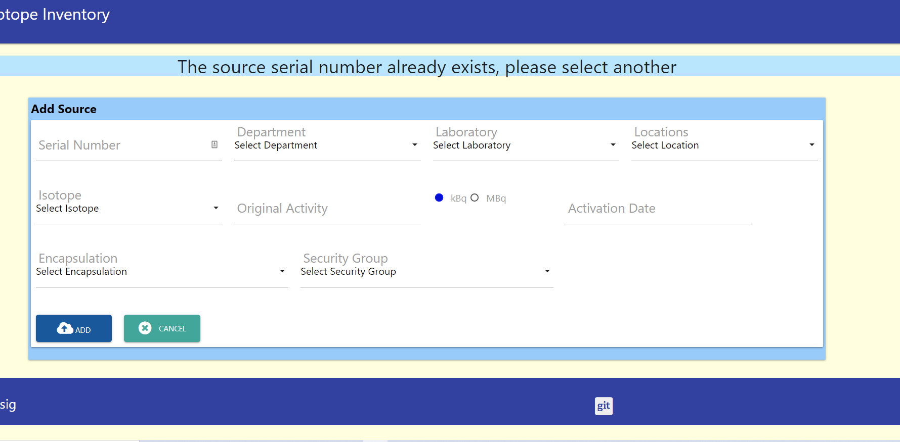
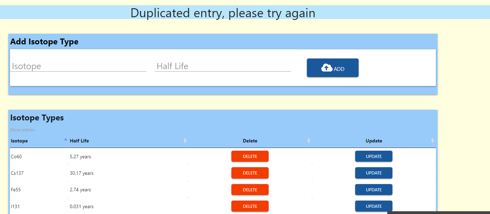

<h1 align="center">Radioisotope Inventory Management</h1>
<h2 align="center"> Milestone 3 Project</h2>

## Index

- <a href="#nonfunctional-test">1. Non-functional test</a>
- <a href="#usecase-test">2. Use case (functional) test</a>
- <a href="#defects">3. Defects</a>

---
<h1>1. Non functional test</h1>

- **javascript static code analaysis**

    

    No errors or wanings reported.

- **CSS validation report**

    

    No errors or wanings reported.

- **PEP8 Validation Report**

    

    No validation errors.

- **HTML Validation Report**

    With the inclusion of the Jinja templating engine, it is not possible to paste html code into the validator. Instead the application is run and the browser tools used to expose the html source code. This is then pasted into the validator.

    |HTML Page |Errors |Warnings |
    |---|---|---|
    |login| None | See comment below, |
    |register| None | See comment below |
    |User Profile| None | Checked with top and side navbar. See comment below|
    |sourceRequest| None | Checked with top and side navbar. All three modes "source update", "source delete" and "source request" covered See comment below|
    |logout| None | Checked with top and side navbar. See comment below|
    |Approve Source Loan Request | None | Checked with top and side navbar. See comment below|
    |User Access Manangement| None | Checked with top and side navbar.|
    |userDelete| None | Checked with top and side navbar.|
    |inventory| None | Checked with top and side navbar.|
    |updateSource| None | Checked with top and side navbar.|
    |deleteSource| None | Checked with top and side navbar.|
    |addSource| None | Checked with top and side navbar.See comment below|
    |isotopeTypes| None | Checked with top and side navbar.See comment below|
    |isotopeDelete| None | Checked with top and side navbar. |
    |usageReport| None | Checked with top and side navbar. |

    base.html includes a section element, the content of which only becomes visible to the browser when a flash message is rendered. This throws up a validator warning.
    base.html is validated as part of every other html file.    

 - **Responsiveness Report**

    Check to confirm the visual appearance of the page on each device type.
 
    |HTML Page |1640px |ipadPro |ipad|iphone 5/SE|iphone X
    |---|---|---|---|---|---|
    |login|Pass |Pass|Pass| Pass|Pass|
    |register| Pass |Pass|Pass| Pass|Pass|
    |userAccount| Pass |Pass|Pass| Pass|Pass|
    |sourceRequest| Pass |Pass|Pass| Pass|Pass|
    |approveRequest | Pass | Pass | Pass |Pass|Pass|
    |user| Pass | Pass | Pass |Pass|Pass|
    |userDelete |Pass | Pass | Pass |Pass|Pass|
    |inventory| Pass | Pass | Pass |Pass|Pass|
    |updateSources| Pass | Pass | Pass |Pass|Pass|Pass|
    |deleteSources| Pass | Pass | Pass |Pass|Pass|
    |addSources| Pass | Pass | Pass |Pass|Pass|
    |isotopeTypes| Pass | Pass | Pass |Pass|Pass|
    |isotopeDelete| Pass | Pass | Pass |Pass|Pass|
    |isotopeUpdate| Pass | Pass | Pass |Pass|Pass|
    |usageReport| Pass | Pass | Pass | Pass |Pass|
    |404error| Pass | Pass | Pass | Pass |Pass|
    |errorPage| Pass | Pass | Pass | Pass |Pass|

 - **Navigation Report**
 
    Check to confirm that button and links navigate to the correct location.

    |HTML Page |1640px |ipad |
    |---|---|---|
    |login|Pass |Pass|
    |register| Pass |Pass|
    |userAccount| Pass |Pass|
    |sourceRequest| Pass |Pass|
    |approveRequest | Pass | Pass |
    |user| Pass | Pass |
    |userDelete |Pass | Pass |
    |inventory| Pass | Pass |
    |updateSources| Pass | Pass |
    |deleteSources| Pass | Pass |
    |addSources| Pass | Pass |
    |isotopeTypes| Pass | Pass |
    |isotopeDelete| Pass | Pass |
    |isotopeUpdate| Pass | Pass |
    |usageReport| Pass | Pass |
    |404error| Pass | Pass |
    |errorPage| Pass | Pass |

- **Browser Report**
    
    |Browser|Console errors|Appearance|Other Issues |
    |---|---|---|---|
    |Google Chrome| none | as expected |none observed, no navigation issues |
    |Edge | none |as expected| observed, no navigation issues |
    |Firefox | none|as expected | none observed, no navigation issues |
    |Opera |none | as expected | none observed, no navigation issues |

<h1>2. Use case (functional) test</h1>

1. As an admin user I want a simple to setup procedure to permit others users to access the application.

The following test steps setup an initial user with admin rights, isotopes and sources that will be used for testing.

- **Test Method**
    - Launch the application
    - confirm that the login page is displayed
    - click on **Register Your Account**
    - Enter the following registration details:
        - First name: **Joe**
        - Last name: **Black**
        - Email: **joe.black@anyuniversity.com**
        - Password: **new2new2**
        - Repeat password: **new2new2**
        - Department: **Chemistry** *selected from dropdown*
        - Research Group: **Life_after_death**
    - Click **submit**
    - Click on **Login**
        - Enter the Email: **joe.black@anyuniversity.com**
        - Password: **new2new2**

    - **Expected Outcome**
        - The user registers successfully
        - The user logs-in successfully
        - The users profile page is displayed
        - The user has admin rights  

    - **Tested Outcome**

        

        - The user account details are displayed 
        
        - The navigation bar shows all admin options

    - **Test Method**
        - Select **Settings** and the **Isotopes**
        - At the top of the page add each of the following isotopes and its half life:

            

    - **Expected Outcome**
        - The isotope types and its half life is displayed in the list below:

    - **Tested Outcome**
        
        

    - **Test Method**
     
     - Select the **Source** navigation button and then the **Add Source** button.

     - Using the form displayed add the following sources one at a time.

    |Serial Number|department|Laboratory|Location|Isotope|Original Activity|Activation Date|Encapsulation|Security Group|
     |---|---|---|---|---|---|---|---|---|
     |sc001|Physics|Lab 1|Top|Na22|320|05-01-20|Capsule|4a|
    |sc002|Chemistry|Lab 2|Middle|Mn54|100|01-01-20|Disk|5d|
    |sc003|Biology|Lab 3|Bottom|Sr90|200|01-01-20|Capsule|5c|

     - **Expected Outcome**

        - 3 sources should be entered into the inventory.

    - **Tested Outcome**

        - After each source is entered the full inventory listing should be displayed
        
        

        - At a reduced screen width, the table above should appear as a collapsible.

        

    - **Test Method**
    
        Select the **logout** navigation option.

2. As a first time user, I want to be able to register with the application so that I am authorised to use the radioactive sources available in the faculty.

    - **Test Method**
        - Launch the application
        - confirm that the login page is displayed
        - click on **Register Your Account**
        - Enter the following registration details:
            - First name: **Niels**
            - Last name: **Bohr**
            - Email: **niels.bohr@anyuniversity.com**
            - Department: **physics** *selected from dropdown*
            - Research Group: **Quantum_Mechanics**
        - Click **submit**

        - click on **Register Your Account**
        - Enter the following registration details:
            - First name: **Fred**
            - Last name: **Hoyle**
            - Email: **fred.hoyle@anyuniversity.com**
            - Department: **physics** *selected from dropdown*
            - Research Group: **Astro_Physics**
        - Click **submit**

        - Attempt to login using Fred Hoyles email and password

    - **Expected Outcome**
        
        In each case a message should appear on the screen **You have sucessfully registered, please wait for your request to be approved**

        Attempting to log in without approval results in the following message being dispayed **Account not approved or suspended**

    - **Tested Outcome**

        Outcome as expected

3. As a user, I want to login and out of the web application securely

    - **Test Method**

        - Enter the username **niels.bohr@anyuniversity.com**
        - Enter the password **new2new2**
        - Click **Submit**

    - **Expected Outcome**

        - **niels.bohr@anyuniversity.com** is sucessfully logged in
        - The navigation bar displays the options assocaited with a user

    - **Tested Outcome**
    
        - The profile for Niels Bohr is displayed as below:

            

4. As a user, I want to view my registration profile.

    - Tested in 3. (above)

5. As a user, I want to change my password, department and research group.

    - **Test Method**

        - Enter the new password **new3new3**
        - Enter the department **Chemistry**
        - Enter the Research Group **Electron_spin**
        - click **submit**
        - select the **logout** navigation bar item
        - Attempt to login using the password of **new2new2**
        - Attempt to login using the password of **new3new3**

    - **Expected Outcome**

        - A message should flash indicating that an incorrect password has been entered
        - Entering the correct password should allow login to succeed. 

    - **Tested Outcome**

        - The profile for Niels Bohr is displayed as below:

            

6. As a user, I want to search for different types of sources that I will need for my research work in the future and view the results.

    - **Test Method**

        - Select the navigation item **Source Request**
        - Into the search box type **Disk**
        - Click **Find**
        - Request source **sc001** 

    - **Expected Outcome**

        - The user is able to select from available sources fitting the search criteria.

    - **Tested Outcome**

        - The user is able to search for available sources

            

    - **Test Method**

        - Open another browser window and navigate to the application website
        - Login as **fred.hoyle@anyuniversity.com* password: **new2new2**
        - Select the navigation item **Source Request**
        - Into the search box type **Disk**
        - Click **Find**
        - Request source **sc002**

   - **Expected Outcome**

        - The user is able to select from available sources fitting the search criteria. In this case only source sc002 is available.

    - **Tested Outcome**

        - The user is able to search for available sources - only SC002 is available

            

        - **Confirms that once a source has been selected by one user it is nolonger available for other users to select**      

7. As a user, I want to view all the sources that I have loaned so that I can determine which ones I need to return.

    - **Test Method**

        - Select user profile for Niels
        - Confirm that Niels has requested source SC001 from the **Loan Sources** table.
        - click **Delete**
        - Select the user profile for Fred
        - Select the Navigation item **Source Request**
        - Enter the search criteria **Disk**
        - Confirm that source **SC001** is again available 

    - **Expected Outcome**
        
        - Niels has requested no sources 
        - Fred has a request open for source **SC002**
        -**SC001** is available to be loaned out 

    - **Tested Outcome**

        - Source Loan status

            

            

            
        
        **The loan status of a source is immediatelly reflected after users actions** 

7. As an user, I want the present activity of the source to be calculated and displayed so that I can confirm that it will be suitable for my work.

    - **Tested Outcome**

        Test in 6 above. Note the difference between the original activity of source SC001 and its activity now (234kBq then and 152.46kBq). No wonder Niels though again about his source request!

8. As a user, I want to create a request for a sources of the required type from the inventory of available sources and have my request approved.

    - **Test Method**

        - Login as **joe.black@anyuniversity.com** with password **new2new2**

        - Select **Inventory** from the navigation bar and then **Approve Request**

        - Click on the button to approve the loan request for source **SC002**

        - Login as **fred.hoyle@anyuniversity.com** with password **new2new2**

        - On Fred's profile page check that the source loan has been approved

        - Log out Joe and Fred

    - **Expected Outcome**

        - Fred's loan of source **SC002** has been approved 

    - **Tested Outcome**

        -  Approval of Fred's loan of source **SC002** by Joe.

            

        - Fred's profile showing the loan of source **SC002**

            

9. As a user I want to delete my request prior to its approval if I change my mind regarding the type of source.

    Tested in 6.

10. As an admin user, I want to approve user each registration request so that I can ensure that the correct Health and Safety briefing has been given.

    Tested in 2.

11. As an admin user, I want to view the registration status of all other users.

    - **Test Method**

        - Login as **joe.black@anyuniversity.com** with password **new2new2**

        - Select **User Access** from the navigation bar

        - click on the **approved** button to suspend Fred's account

        - click on **user** button to promote Joe's  account to admin

        - log out of Joe's account

        - Attempt to login to Fred's account with username **fred.hoyle@anyuniversity.com** and password **new2new2**

        - Attempt to login to Niels' account with username **niels.bohr@anyuniversity.com** and password **new3new3**  

    - **Expected Outcome**

        - Niels account has admin access rights. 

        - Fred's account is not accessible.

    - **Tested Outcome**

        - Changed user account status 
        
            
        
        - Fred is not able to log into his account

            

        - Niels has admin rights

            

12. As an admin user, I want to update the access rights of  other users to that of admin to create deputies

    - Tested in 11

13. As an admin user, I want to suspend a user account to prevent a user from loaning more sources.

    - Tested in 11

14. As an admin user, I want to permanently delete as user acccount, but only if the user has returned all loaned sources

    - **Test Method**

        - Login as **fred.hoyle@anyuniversity.com** with password **new2new2**

        - Navigate to **Request Source**

        - In the search box enter **Disk** and select sources sc001

        - log out

        - Login as **joe.black@anyuniversity.com** with password **new2new2**

        - Navigate to **Inventory** and then **Approve Request**

        - Approve Fred Hoyle's request for sources sc001.

        - Navigate to **User Access**

        - Click on **Delete** against Fred Hoyle

        - Confirm that it is not possible to delete Fred Hoyle's account unless it has been suspended.

        - Click on the **Approved** button against Fred Hoyle's account to suspend the account.

        - Click on the **Delete** button against Fred Hoyle's account.

        - Confirm that it is not possible to delete Fred Hoyle's account as he still has a source on loan.

        - Navigate to **Inventory** and then **Approve Request**

        - Click on the **Return** button for source sc001.

        - Navigate to **User Access** and click on the **Delete** button against Fred Hoyle's account

        - Confirm that Fred Hoyle's account has been deleted

    - **Expected Outcome**

        - An account cannot be deleted if not first suspended

        - An account cannot be deleted if the user has sources on loan

        - An account can only be deleted if the the user has been suspended and has no sources on loan

    - **Tested Outcome**

        - An account cannot be deleted unless it has been suspended

            

        - An account cannot be deleted if the user still has source on loan

            

        - An account can only be deleted if the the user has been suspended and has no sources on loan

            

15. As an admin user, I want to view the technical characteristices of all sources so that users can be advised on their selection.

    - **Test Method**

        - Login as **niels.bohr@anyuniversity.com** with password **new2new2**

        - Navigate to **Request Source** 

        - In the search box enter **capsule** and select the source and click on enter

        - Logout

        - Login as **joe.black@anyuniversity.com** with password **new2new2**

        - Navigate to **Inventory** and then **Inventory List**

        - Confirm that the complete list of available sources is displayed and that Fred Hoyle has a source on loan.

        - Logout

        - Login as **niels.bohr@anyuniversity.com** with password **new2new2**

        - Navigate to **Inventory** and then **Inventory List**

        - Confirm that admin user Niels Bohr has the same source inventory view as Joe Black

        - logout

        - Login as **fred.hoyle@anyuniversity.com** with password **new2new2**

        - Confirm that user Fred Hoyle is not able to navigate to  **Inventory** and then **Inventory List**

    - **Expected Outcome**

        - All source data including the current user of the source is displayed in tabular form for any admin user to view

        - A source list is not available to non admin users

    - **Tested Outcome**
        - Complete inventory of sources and currect users. The view is available to both Niels Bohr and Joe Black 

            

        - The inventory view is not available to user Fred Hoyle as a user

            

16. As an admin user, I want to view the location of all sources on inventory to satisfy a security audit.

    Tested in 15

17. As an admin user, I want to create a new entry source entry with the same or different technical charateristc but with a unique serial number.

    - **Test Method**

        - Login as **joe.black@anyuniversity.com** with password **new2new2**

        - Navigate to **Sources** and **Add Source**

        - Enter an source serial number **sc001** and complete the remainder of the form.

        - Confirm that a source with an existing serial number cannot be entered

        - Navigate to **Sources** and **Add Source**

        - Enter an source serial number **sc006** and complete the remainder of the form as for source sc001.

        - Click on **Add**

        - Navigate to **Inventory** and then **Inventory List**

        - Confirm that sources **sc001** and **sc006** are identical except for the serial number 

    - **Expected Outcome**

        - The can be no duplicate source serial numbers

        - Sources **sc001** and **sc006** have the same specification

    - **Tested Outcome**

        - Duplicate source serial numbers not permitted

            

        - Sources can have the same specification, but must have unique serial numbers

            

18. As an admin user, I want to update the technical characteristics of an existing source if there is an error either by selecting from the full inventory or by searching on the serial number.

    - **Test Method**
    
        - Login as **joe.black@anyuniversity.com** with password **new2new2**

        - Navigate to **Inventory** and then **Inventory List**

        - Click on **Update** against source with serial number **sc005**

        - Change the **Laboratory** from **lab 1** to **lab 2** and click on **Update**

        - Navigate to **Sources** and then **Update Source**

        - In the search box enter **I131** and click on **Find**

        - Click on the **Update** button for source **sc007**

        - Change the **Laboratory** from **lab 2** to **lab 3** and click on **Update**

        - Confirm that source **sc005** has been updated to **Lab 2** and that source **sc007** has been updated to **Lab 3**
    
    - **Expected Outcome**

        - Source **sc005** has been updated to **Lab 2** and that source **sc007** has been updated to **Lab 3**

    - **Tested Outcome**

        - Source **sc005** has been updated to **Lab 2** and that source **sc007** has been updated to **Lab 3**

        - Before update

            

        - After update

            

19. As an admin user, I want to delete a source from the inventory either by selecting from the full inventory or by searching on the serial number, but only if that source has been returned to the inventory.

    - **Test Method**

        - Login as **joe.black@anyuniversity.com** with password **new2new2**

        - Navigate to **Inventory** and then **Inventory List**

        - Click on **Delete** against source with serial number **sc005**

        - Click on **Delete** again to confirm

        - Confirm that source **sc005** could not be deleted because it is still on loan to user Niels Bohr

        - Navigate to **Sources** and then **Delete Source**

        - Enter **I131** and click on the **Delete** button

        - Click again on **Delete** to confirm deletion

        - Confirm that source **sc005** cannot be deleted because it is still on loan to user Niels Bohr

        - Navigate to **Inventory** and then **Inventory List**

        - Click on **Delete** against source with serial number **sc007**

        - Click on **Delete** again to confirm

        - Confirm that source **sc007** is deleted

        - Navigate to **Sources** and then **Delete Source**

        - Click on **Delete** against source with serial number **sc002**

        - Click on **Delete** again to confirm

        - Confirm that sources **sc007** and **sc002** have been deleted
    
    - **Expected Outcome**

        - Source **sc005** is on loan to user Niels Bohr and cannot be deleted

        - Source **sc007** is deleted via the **Inventory List** and source **sc002** deleted by searching for the source.

    - **Tested Outcome**

        - Source **sc005** is not deleted

          

        - Sources **sc007** and **sc002** successfully deleted

          

20. As an admin user, I want to view all the isotope types available

    - **Test Method**

        - Login as **joe.black@anyuniversity.com** with password **new2new2**

        - Navigate to **Settings** and then **Isotopes**

        - Confirm that the list of isotopes is displayed

    - **Expected Outcome**

        - Isotope list displayed

    - **Tested Outcome**

        - Isotope type list 

            

21. As an admin user I want to add isotope types and their respective half lives to the list.

    - **Test Method**

        - Login as **joe.black@anyuniversity.com** with password **new2new2**

        - Navigate to **Settings** and then **Isotopes**

        - Enter the isotope Co60 with a half life of 4.75 years

        - Confirm that the entry is rejected as a duplicate

        - Enter the isotope Co56 with a half life of 77 years

        - Confirm that the isotope list now includes Co56

    - **Expected Outcome**

        - Duplicate isotope entries are rejected

        - New isotope types can be added to the list

    - **Tested Outcome**

        - Duplicate isotope entries are rejected
    
            
    
        - An entry for isotope Co56 is created

            

22. As an admin user I want to update information assocaited with an isotope.

    - **Test Method**

        - Login as **niels.bohr@anyuniversity.com** with password **new2new2**

        - Navigate to **Settings** and then **Isotopes**

        - Click the **Update** button against isotope C56

        - Change the half life to 77.27 years

        - View the list of isotopes and confirm that isotope C56 now has a half life of 77.27 years

    - **Expected Outcome**

        - The isotope half life of a source may be updated by another admin user

    - **Tested Outcome**

        - Updated isotope C56

            

23. As an admin user I want to delete isotope types, but only if all sources of that isotope type are not on loan.

    - **Test Method**

    - **Expected Outcome**

    - **Tested Outcome**

24. As an admin user, I want to view the full history of source loans so that I can spot any patterns.

    - **Test Method**
        
        - Login as **joe.black@anyuniversity.com** with password **new2new2**

        - Navigate to **Source Request**

        - In the search box type **Disk**

        - Select source **sc001** and click on **Request**

        - In the search box type **Disk**

        - Select source **sc003** and click on **Request**

        - Navigate to **Inventory** and the **Approve Request**

        - Click on **Approve** to approve the loan of both sources

        - Navigate to **Inventory** and the **Usage Report**

        - Confirm that both sources with serial numbers sc001 and sc003 have an out date but no **in_date**.

        - Navigate to **Inventory** and the **Approve Request**

        - Click on return against source sc001

        - Navigate to **Inventory** and the **Usage Report**

        - Confirm that source with serial number sc001 has an associated **in_date**

    - **Expected Outcome**

        - The source loan history shows source sc001 loaned out and returned and source sc003 still on loan.

    - **Tested Outcome**
 
        - Loan history of sources sc001 and sc003 

            

25. As an admin user, I want to view how many times a source has been loaned by isotope type so that I can dispose of sources that are not being loaned.

    - **Test Method**

        - Login as **joe.black@anyuniversity.com** with password **new2new2**

        - Navigate to **Inventory** and select **Usage Report**

        - Confirm how many time scource with serial number sc001 has been loan out

        - Navigate to **Source Request**

        - In the search box type **Disk**

        - Select source **sc001** and click on **Request**

        - Navigate to **Inventory** and the **Approve Request**

        - Click on **Approve**

        - Navigate to **Inventory** and select **Usage Report**

        - Confirm how many time scource with serial number sc001 has been loan out 

    - **Expected Outcome**

        - The number of times source sc001 has been loaned has increased by 1

    - **Tested Outcome**

     - The number of times source sc001 has been loaned out has increased by 1: 
        
        

        

26. As an admin user, I want to view how user logins there have been on a given date so that I can assses how the service is being used.  

    - **Test Method**

        - Login as **joe.black@anyuniversity.com** with password **new2new2**

        - Navigate to **Inventory** and select **Usage Report**

        - Confirm the User Logins by day

        - logout

        - login as **fred.hoyle@anyuniversity.com** and password **new2new2**

        - logout

        - Login as **joe.black@anyuniversity.com** with password **new2new2**

        - Navigate to **Inventory** and select **Usage Report**

        - Confirm the User Logins by day has increased by 2   

    - **Expected Outcome**

        - Logins per day has increased by 2

    - **Tested Outcome**

        - Logins per day has increased by 2: 
        
            

             

27. As a scientist, I want to see information presented in a tabular form where possible so that I can spot patterns in the data.

    - Tested in 28 

28. As a user or admin user, I may want to view information on small screen width devices which do not lend themselves to displaying data in tabular form.

    - **Test Method**

        - Login as **joe.black@anyuniversity.com** with password **new2new2**

        - Navigate to **Inventory** and select **Inventory List**

        - Using the browser tool kit set the screen size to 1024px

        - Confirm that the inventory is displayed in tabular form

        - Reduce the screen width to 760px

        - Confirm that the same inventory is displayed as a collapsible.

        - Navigate to **User Access** and repeat the above steps

        - Navigate to **Settings** and the **Isotopes** and repeat the above steps    

    - **Expected Outcome**

        - Information displayed in a tabular form on a screen widths 1024px and up is displayed as a collapsible on lower screen widths.   

    - **Tested Outcome**

        - Source data displayed both in tabular form and as a collapsible: 
        
            

             

29. As a user or admin user, I want to confirm any delete action that results in the permanent removal of information from the data base.

    - **Test Method**

        - Login as **joe.black@anyuniversity.com** with password **new2new2**

        - Navigate to **Inventory** and select **Inventory List**

        - Click on **Delete** for source **sc001**

        - Confirm that the user is requested to re-confirm the deletion request 

        - Navigate to **Settings** and then **Isotope**

        - Click on **Delete** for isotope **C60**

        - Confirm that the user is requested to re-confirm the deletion request

         - Navigate to **User Access**

         - Ensure that the user account for user **Fred Hoyle** has been suspended

        - Click on **Delete** for user **Fred Hoyle**

        - Confirm that the user is requested to re-confirm the deletion request

    - **Expected Outcome**

        - The user is requested to confirm the deletion of source **sc001**

        - The user is requested to confirm the deletion of isotope type **Co60**

        - The user is requested to confirm the deletion of the account for **Fred Hoyle**

    - **Tested Outcome**

        - The admin user is requested to confirm the deletion of source **sc001**

             

        - The admin user is requested to confirm the deletion of isotope **Co60**

             

        - The admin user is requested to confirm the deletion of user **Fred Hyole**

                 

<h1>3. Defects</h1>

|No|Defect Description |Defect resolution |
|---|----------------- |----------------- |
|1| "no source found flash message is displayed before user query's for an available source|Check query return for an empty string and prevent flash message.  |
|2|Clear isotope update button crashed program  |Re-direct code flow to use function "manage_isotopes" |
|3| Approve Source Loan Request Page has email address and not user name|Add python code to display user first name and last name |
|4|User management page had button colour mismatch between table and collapsible.|Add html code to give buttons same appearance|
|5|Delete user account page was found not to render on a small screen width|Replace user account page with collapsible for small screen widths|
|6|Faulty regex pattern for isotope type|Update regex pattern to reflect feature description in README|
|7|Update to user profile caused null content password|Add check for null content password|
|8|First user to register must have admin rights to permit subsequent users to register.|Detect special registration condition where the number of users registered is equal to zero and set admin rights.
|9|Update Account Detail page missing a cancel button | Add cancel button and re-validate html code|
|10|requestSource.html Space between "Find" and "Cancel" buttons too far apart| Remove div element and make col wider. Re-validate html code |
|11|addSource.html Buttons incorrectly located and not in keeping with the rest of the site| Move the location of the buttons and re-validate html code|
|12|updateSource.html Cancel update button directed to the wrong url|Redirect update button to update_source and re-validate html code|
|13|isotopeType.html missing Cancel button|Add Cancel button to isotopeType.html|
|14|Nav bar elements clash at small screen sizes|Re-factor Nav-bar in base.html|
|15|Defect variable "date_out" spelt "data_out" caused db error|Corrected spelling in python code and validate functionality|
|16|Source search criteria prior to the deletion of an isotope type inadequate|Update search criteria to make sure that both requested or aproved source loans are covered for a given isotope type|    